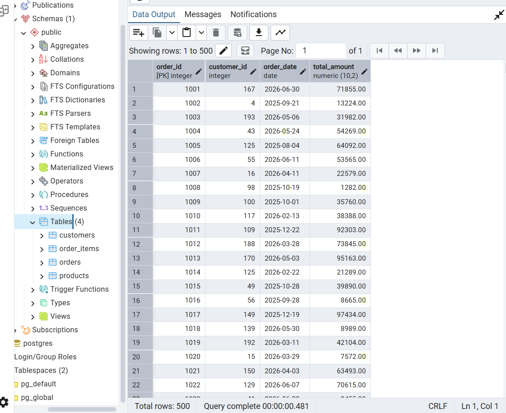
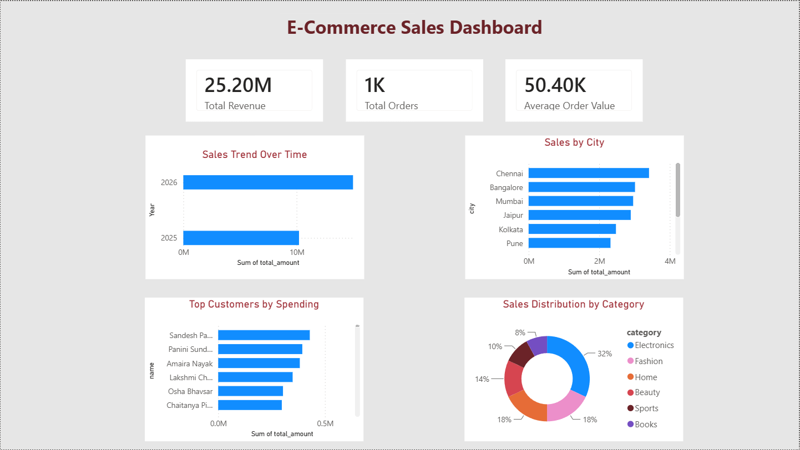

# E-Commerce Data Warehouse

## About the Project

This project is an end-to-end E-Commerce Data Warehouse built using **Python, PostgreSQL, SQL, and Power BI**.

The goal of this project was to understand how data moves from raw files to a business dashboard.

First, I generated sample e-commerce data using Python. Then I cleaned and loaded the data into PostgreSQL using an ETL process. After storing the data, I wrote SQL queries to analyze sales and finally connected PostgreSQL to Power BI to create an interactive dashboard.

---

## Technologies Used

- Python
- Pandas
- Faker
- PostgreSQL
- SQL
- Power BI

---

## How the Project Works

```
Python (Generate Data)
          ↓
CSV Files
          ↓
Python ETL
          ↓
PostgreSQL Database
          ↓
SQL Queries
          ↓
Power BI Dashboard
```


---

## Database Schema

The project uses PostgreSQL as a data warehouse with the following tables:

- **customers**: Stores customer information
- **products**: Stores product details and categories
- **orders**: Stores customer orders and transaction details
- **order_items**: Stores product-level order details

Example database tables:



---

## Features

- Generated realistic e-commerce data using Python and Faker.
- Built an ETL pipeline to extract, transform, and load data.
- Cleaned and transformed raw data using Pandas.
- Loaded processed data into a PostgreSQL data warehouse.
- Wrote SQL queries to analyze sales, customers, and products.
- Created an interactive Power BI dashboard with key business insights.
---

## Dashboard



---

## Business Insights

The dashboard shows:

- Total Revenue
- Total Orders
- Average Order Value
- Revenue by Category
- Sales by City
- Monthly Sales Trend
- Top Customers

---

## Project Structure

```text
ecommerce_dw/
│
├── data/              # Generated CSV files
├── scripts/           # Python scripts (Data Generation & ETL)
├── sql/               # Database creation and analysis queries
├── powerbi/           # Power BI dashboard (.pbix)
├── screenshots/       # Dashboard images
├── README.md          # Project documentation
├── requirements.txt   # Python dependencies
└── .gitignore         # Git ignore rules
```

---

## Author

**Kashrita Thapa**
